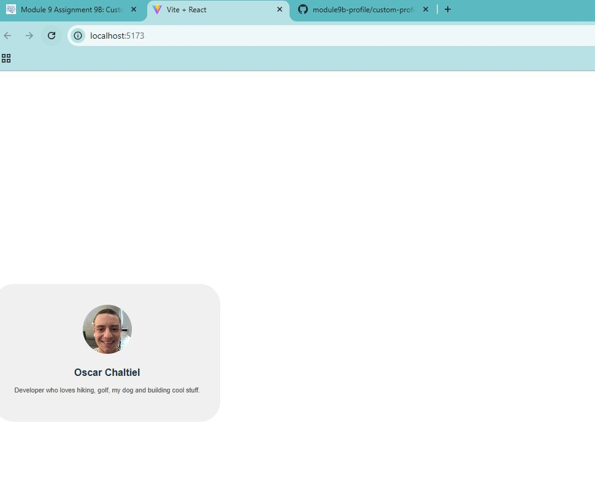

# Module 9B - Custom Profile Component

## Description
This is a React app built with Vite. It contains a profile component styled with inline CSS.

## What I Learned
- How to use JSX
- How to style with inline CSS
- How to create and render functional components

## Challenges
I initially ran into an issue when setting up the Git remote because the origin was already set.  
I fixed this by checking my existing remote with `git remote remove origin` and adding the correct one.  
I also experimented with different styles (background color, padding, border radius) to get the layout I wanted.

## Screenshot

      